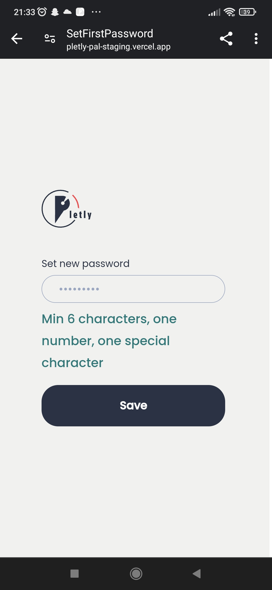

# Bug Report: Missing Password Visibility Option during Caregiver Creation or Password Reset

## Summary
When creating a new caregiver from the organization level, there is no option to view the entered password. Users cannot verify if they have entered the password correctly.

## Severity
🟡 Medium

## Priority
🟡 Medium

## Steps to Reproduce
1. Log in to the organization account.
2. Select the organization.
3. In the caregivers tab, click on "New Employee".
4. Create a new account for the employee using valid data.
5. Go to the new user's email inbox.
6. Open the welcome email.
7. Click the "Set Your Password" button.
8. Enter a few characters into the password field.

## Actual Result
There is no option to view the entered password or to confirm it in a second field.

## Impact
Users may enter incorrect passwords without realizing it, leading to potential issues with login and security.

## Suggested Fix
Implement an eye icon to show the password in the password field during the caregiver creation process.

## Environment
- **Application Version**: Pletly Pal (staging) 1.0.22
- **Device**: Xiaomi Redmi Note 8 Pro
- **Operating System**: Android 11

